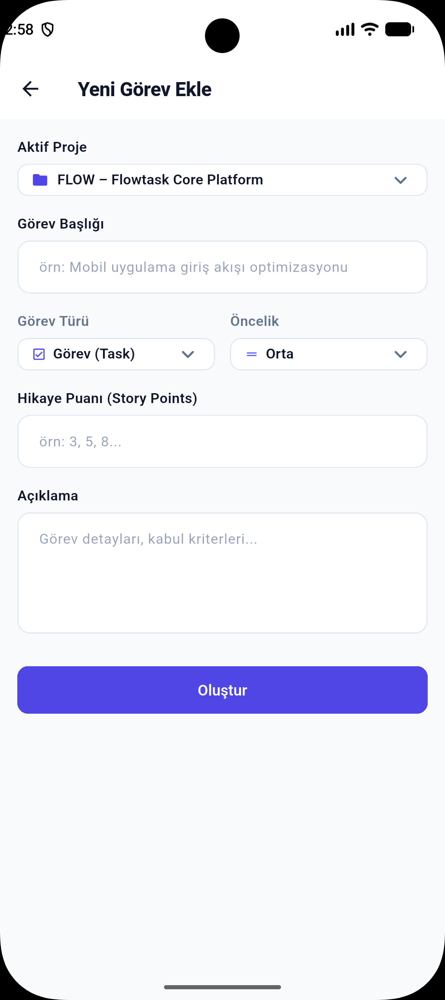
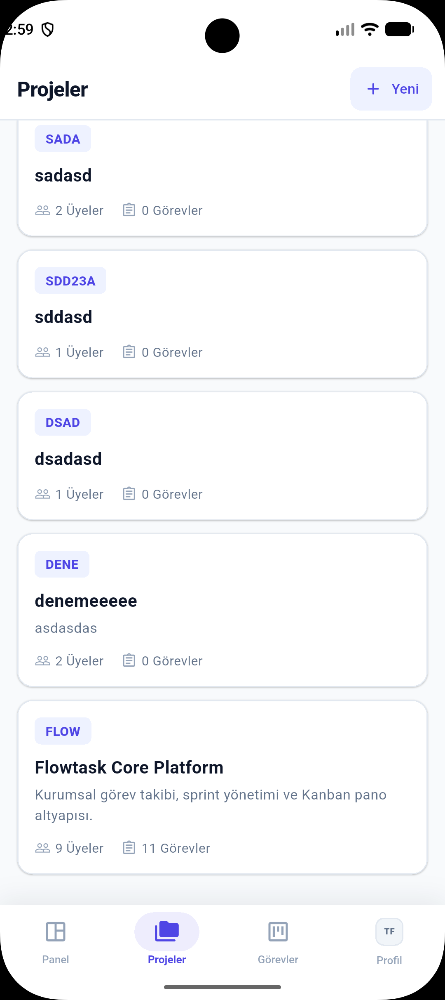
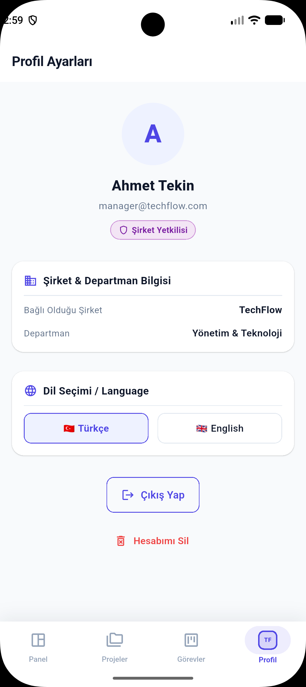
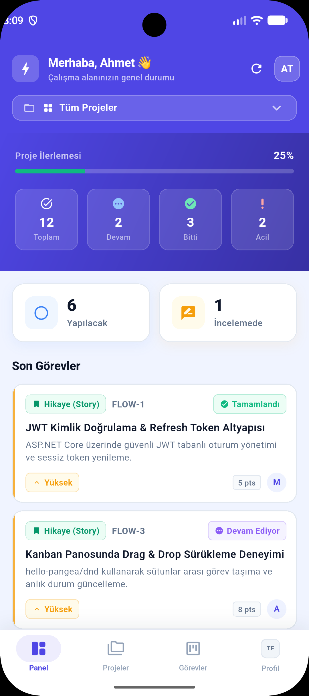
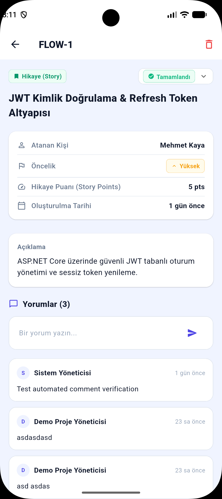
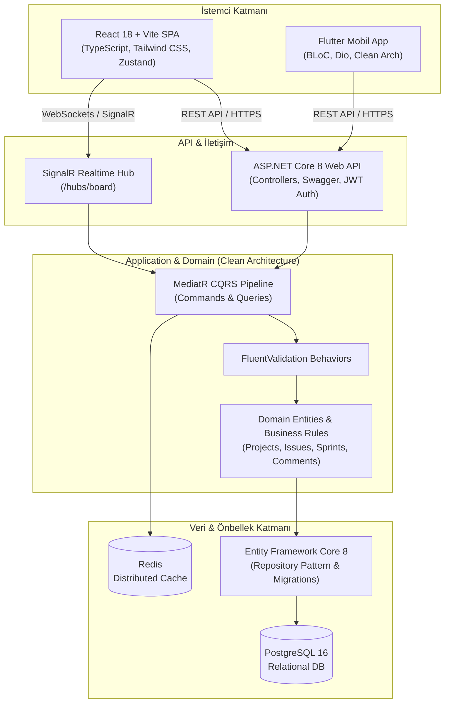

# FlowTask — Multi-Tenant Enterprise Task & Workflow Management Platform

<p align="center">
  
</p>

<p align="center">
  <strong>Modern, ölçeklenebilir ve kurumsal seviyede çok kiracılı (multi-tenant) proje ve görev yönetim sistemi.</strong><br/>
  .NET 8 Clean Architecture backend, React 18 + TypeScript web paneli ve Flutter mobil uygulamasını tek bir monorepo yapısında buluşturur.
</p>

<p align="center">
  
  
  
  
  
  
  
  
  
</p>

---

## 📑 İçindekiler
1. [Proje Hakkında](#-proje-hakkında)
2. [Ekran Görüntüleri Galerisi](#-ekran-görüntüleri-galerisi)
   - [Web Uygulaması](#web-uygulaması-react-18--typescript)
   - [Mobil Uygulama](#mobil-uygulama-flutter)
3. [Mimariler ve Kullanılan Teknolojiler](#-mimariler-ve-kullanılan-teknolojiler)
   - [Backend (.NET 8 Clean Architecture)](#backend-api--servis-katmanı)
   - [Frontend (React 18 & TypeScript)](#frontend-web-uygulaması)
   - [Mobile (Flutter & BLoC)](#mobile-mobil-uygulama)
4. [Monorepo Proje Yapısı](#-monorepo-proje-yapısı)
5. [Temel Fonksiyonel Özellikler](#-temel-fonksiyonel-özellikler)
6. [Kurulum ve Çalıştırma Rehberi](#-kurulum-ve-çalıştırma-rehberi)
   - [Ön Koşullar](#ön-koşullar)
   - [1. Veritabanı ve Redis (Docker)](#1-veritabanı-ve-redis-docker)
   - [2. Backend Çalıştırma](#2-backend-çalıştırma)
   - [3. Frontend Web Çalıştırma](#3-frontend-web-çalıştırma)
   - [4. Mobil Uygulama Çalıştırma](#4-mobil-uygulama-çalıştırma)
7. [API Uç Noktaları ve Swagger](#-api-uç-noktaları-ve-swagger)
8. [Demo Kullanıcı Hesapları](#-demo-kullanıcı-hesapları)

---

## 🎯 Proje Hakkında

**FlowTask**, ekiplerin projelerini, görevlerini ve iş akışlarını kolayca takip edebilmesi için geliştirilmiş bir proje yönetim platformudur.

* **Şirket ve Departman Yönetimi:** Her şirket kendi projelerini, ekiplerini ve departmanlarını ayrı alanlarda yönetir.
* **Otomatik Görev Kodları:** Her göreve projesine özel benzersiz bir kod atanır (`FLOW-1`, `FLOW-2`, `INNO-5`).
* **Canlı Durum Güncellemesi:** Panodaki sürükle-bırak hareketleri, durum değişiklikleri ve yorumlar anında ekrana yansır.
* **Modern Açık Tema:** Gözü yormayan, sade ve net bir arayüz deneyimi sunar.

---

## 📸 Ekran Görüntüleri Galerisi

### Web Uygulaması (React 18 + TypeScript)

| **Sürükle-Bırak Kanban Pano** | **Dashboard & Yönetici Kontrol Paneli** |
|:---:|:---:|
|  |  |
| *4 sütunlu sürükle-bırak görev akış panosu* | *Proje durumları, ekip performansı ve görev dağılımı* |

| **Sprint & Backlog Filtreleme** | **Ekip & Aktif Kullanıcılar Panosu** |
|:---:|:---:|
|  |  |
| *Sprint ve backlog bazlı anlık tahta filtreleme* | *Kullanıcı bazlı iş yükü ve görev dağılımı* |

| **Detaylı Görev & Aktivite Modalı** | **Yeni Görev Oluşturma Formu** |
|:---:|:---:|
|  |  |
| *Yorumlar, dosya ekleri ve görev detayları* | *Görev tipi, öncelik ve atanan kişi seçimi* |

| **Global Arama & Command Palette** | **Önemli Sistem Bildirimi / Acil Uyarı** |
|:---:|:---:|
|  |  |
| *Görev ve projeler için hızlı arama menüsü* | *Kritik duyurular ve sistem bildirimleri* |

---

### Mobil Uygulama (Flutter)

<p align="center">
  
  
  
</p>
<p align="center">
  
  
</p>

* **Anasayfa & Özet:** Görev tamamlama oranı, durum kartları ve son görevler listesi.
* **Görevler Panosu:** Yapılacak, Devam Eden, İncelemede ve Tamamlandı filtreleme ızgarası.
* **Proje Seçici:** Projeler ve tüm şirket görevleri arasında tek dokunuşla hızlı geçiş.
* **Çift Dil Desteği:** Türkçe ve İngilizce dil seçeneği.

---

## 🏗 Mimariler ve Kullanılan Teknolojiler



---

### Backend (API & Servis Katmanı)
* **Framework:** .NET 8 (C# 12) Web API
* **Mimari:** Clean Architecture (Domain, Application, Infrastructure, Presentation) + **CQRS (Command Query Responsibility Segregation)**
* **Orchestration / Mediator:** `MediatR` ile ayrıştırılmış Command/Query işleyicileri
* **Doğrulama:** `FluentValidation` + Validation Pipeline Behaviors
* **Veritabanı & ORM:** `PostgreSQL 16` + `Entity Framework Core 8` (Code-First Migrations, Fluent API Configuration)
* **Önbellekleme:** `Redis` (Distributed Cache & Lock Manager)
* **Gerçek Zamanlı İletişim:** `Microsoft.AspNetCore.SignalR`
* **Güvenlik & Kimlik Doğrulama:** `JWT Bearer Token`, Argon2/BCrypt parola güvenliği, Claims-based multi-tenancy çözümleyici middleware
* **Dökümantasyon:** Swagger / OpenAPI UI + JWT Authorization entegrasyonu

---

### Frontend (Web Uygulaması)
* **Kütüphane & Runtime:** React 18, TypeScript, Vite
* **Stil & Tasarım:** Tailwind CSS, PostCSS, Lucide Icons, Headless UI
* **Durum Yönetimi:** `Zustand` (Global Auth, Proje, Tema ve Modal state store'ları)
* **Veri Yönetimi & Caching:** `@tanstack/react-query` v5 (Optimistic UI updates, automatic cache invalidation)
* **Sürükle-Bırak (DnD):** `@hello-pangea/dnd` ile akıcı Kanban kart taşıma ve sütun sıralama
* **Gerçek Zamanlı İstemci:** `@microsoft/signalr` istemci entegrasyonu
* **Grafik & Analitik:** `Recharts` (Haftalık görev tamamlama eğrileri, sprint hız grafikleri)
* **Router:** `React Router DOM` v6 (Korumalı rotalar, rol denetimli sayfalar)

---

### Mobile (Mobil Uygulama)
* **SDK & Dil:** Flutter 3.x, Dart 3.x
* **Mimari:** Feature-based Clean Architecture (Domain, Data, Presentation)
* **State Management:** `flutter_bloc` (BLoC Pattern & Cubit) + `equatable`
* **Network & HTTP:** `Dio` (JWT Interceptors, Token Injection, Response Parsing, Error Handling)
* **Tasarım & Responsive Motoru:** `ResponsiveContext` extension'ı, `AppDimensions` ve `AppColors` token tabanlı tasarım mimarisi
* **Yerelleştirme (i18n):** `AppTranslations` motoru (TR / EN tam dil anahtarı desteği)
* **Platform Uyumluluğu:** Android & iOS native derleme

---

## 📂 Monorepo Proje Yapısı

```text
FlowTask_Net_Core_Flutter_React_Fullstack/
├── backend/
│   ├── src/
│   │   ├── FlowTask.Domain/              # Varlıklar (Entities), Enums, Domain Exceptions
│   │   ├── FlowTask.Application/         # CQRS Commands & Queries, DTOs, Use Cases, Interfaces
│   │   ├── FlowTask.Infrastructure/      # EF Core DbContext, PostgreSQL Repositories, Redis, SignalR
│   │   └── FlowTask.Api/                 # Controllers, Middlewares, Hubs, Dependency Injection
│   ├── FlowTask.sln                      # .NET Solution dosyası
│   └── Dockerfile                        # Backend container konfigürasyonu
├── frontend/
│   ├── src/
│   │   ├── api/                          # Axios API istemcisi ve SignalR servisleri
│   │   ├── components/                   # Kanban Board, Modallar, Kartlar, Navigasyon bileşenleri
│   │   ├── pages/                        # Dashboard, Projects, Board, Backlog, Settings sayfaları
│   │   ├── store/                        # Zustand Store'ları (authStore, projectStore vb.)
│   │   └── types/                        # TypeScript domain ve DTO modelleri
│   ├── package.json
│   ├── tailwind.config.js
│   └── vite.config.ts
├── mobile/
│   ├── lib/
│   │   ├── core/                         # Renkler (AppColors), Boyutlar (AppDimensions), Enums, i18n
│   │   ├── data/                         # Remote Data Sources, DTO Modelleri, Repository Impls
│   │   ├── domain/                       # Use Cases, Entities, Repository Sözleşmeleri
│   │   └── presentation/                 # BLoC state'leri, Sayfalar (Dashboard, Board, Profile), Widgetlar
│   └── pubspec.yaml
├── docs/
│   └── screenshots/                      # Web ve Mobil ekran görüntüleri
├── docker-compose.yml                    # PostgreSQL ve Redis servisleri
└── README.md                             # Kapsamlı proje dökümantasyonu
```

---

## ⚡ Temel Fonksiyonel Özellikler

1. **Çoklu Şirket & Departman Seçimi (Multi-Tenancy):**
   - Kullanıcılar bağlı oldukları şirket ve departman sınırları içinde çalışır.
   - Şirket yetkilileri yeni proje oluşturabilir, üye atayabilir ve rol yetkilendirmesi yapabilir.

2. **Dinamik Proje Anahtarı (Issue Key Generator):**
   - Her proje kendine has 2-5 karakterlik bir anahtar (`FLOW`, `INNO`, `DATA` vb.) tanımlar.
   - Her yeni görev, projenin mevcut en yüksek ID'sini referans alarak atomik olarak numaralandırılır (`FLOW-1`, `FLOW-2`).

3. **Kanban & Görev Akış Yönetimi:**
   - Görev Durumları: `Yapılacak (To Do)`, `Devam Ediyor (In Progress)`, `İncelemede (In Review)`, `Tamamlandı (Done)`.
   - Öncelik Kademeleri: `Düşük (Low)`, `Orta (Medium)`, `Yüksek (High)`, `Acil (Urgent)`.
   - Görev Tipleri: `Görev (Task)`, `Hata (Bug)`, `Kullanıcı Hikayesi (Story)`, `Büyük İş (Epic)`.

4. **Gerçek Zamanlı Yorum ve Aktivite Takibi:**
   - Görevlerin altına ekip içi yorumlar eklenebilir, görevin durum değişiklik geçmişi tarih sırasıyla izlenebilir.

---

## 🚀 Kurulum ve Çalıştırma Rehberi

### Ön Koşullar
* [.NET 8 SDK](https://dotnet.microsoft.com/download/dotnet/8.0)
* [Node.js (v18+) ve npm](https://nodejs.org/)
* [Flutter SDK (v3.19+)](https://flutter.dev/docs/get-started/install)
* [Docker Desktop](https://www.docker.com/products/docker-desktop/) (PostgreSQL & Redis için)

---

### 1. Veritabanı ve Redis (Docker)
Projenin kök dizininde yer alan `docker-compose.yml` ile PostgreSQL ve Redis servislerini başlatın:

```bash
docker-compose up -d
```

> **Varsayılan Bağlantı Bilgileri:**
> * PostgreSQL Port: `5432` | DB: `flowtask_db` | User: `postgres` | Password: `password123`
> * Redis Port: `6379`

---

### 2. Backend Çalıştırma

```bash
cd backend/src/FlowTask.Api

# Paketleri geri yükleyin
dotnet restore

# Veritabanı migration'larını uygulayın (Otomatik seed devreye girer)
dotnet ef database update --project ../FlowTask.Infrastructure

# API'yi başlatın
dotnet run
```

Backend API **`http://localhost:5000`** veya **`https://localhost:7001`** adresinde ayağa kalkacaktır.
* **Swagger UI:** `http://localhost:5000/swagger`

---

### 3. Frontend Web Çalıştırma

```bash
cd frontend

# Bağımlılıkları yükleyin
npm install

# Geliştirici sunucusunu başlatın
npm run dev
```

Web uygulaması **`http://localhost:5173`** adresinde açılacaktır.

---

### 4. Mobil Uygulama Çalıştırma

```bash
cd mobile

# Paketleri çekin
flutter pub get

# Kod analizini kontrol edin (0 issue)
flutter analyze

# Cihaz veya emülatörde çalıştırın
flutter run
```

> **Not:** Android Emülatör kullanıyorsanız `ApiClient` base URL'i otomatik olarak `10.0.2.2:5000` adresine, iOS Simülatör veya Web için `localhost:5000` adresine bağlanacak şekilde ayarlanmıştır.

---

## 🔑 Demo Kullanıcı Hesapları

Test süreçleri için sistem açılışında aşağıdaki demo kullanıcılar hazır olarak gelmektedir:

| Rol | E-Posta | Şifre | Şirket | Departman |
|:---|:---|:---|:---|:---|
| **Şirket Yetkilisi** | `manager@techflow.com` | `Password123!` | TechFlow Inc. | Yönetim & Teknoloji |
| **Kıdemli Geliştirici** | `dev@techflow.com` | `Password123!` | TechFlow Inc. | Yazılım Geliştirme |
| **QA Mühendisi** | `qa@techflow.com` | `Password123!` | TechFlow Inc. | Kalite & Test |
| **Şirket Yetkilisi** | `manager@innosoft.com` | `Password123!` | InnoSoft Bilişim | Ürün Yönetimi |

*(Giriş ekranlarında bulunan **"Hızlı Demo Girişi"** butonlarına tıklayarak tek tıkla oturum açabilirsiniz.)*

---

## 📄 Lisans & Katkı
Bu proje kurumsal kullanım ve eğitim amacıyla açık kaynak mimari standartlarına uygun olarak geliştirilmiştir. Katkıda bulunmak için lütfen bir *Pull Request* açın veya bir *Issue* bildirin.
